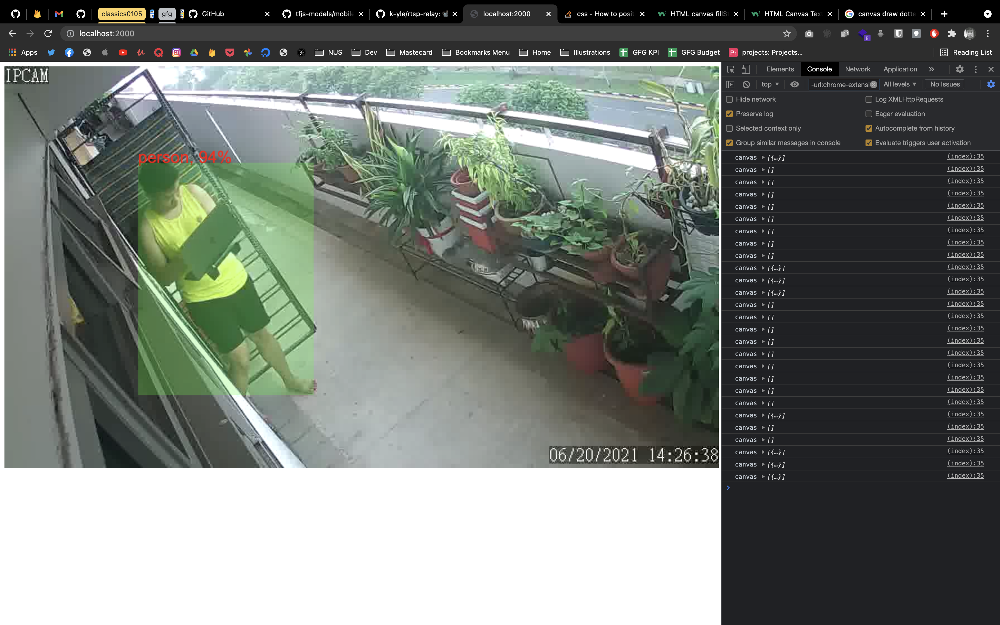

# Making my IP Camera smart 

While enjoying my weekends, I stumbled upon a [youtube video](https://youtu.be/VGhh90oZ3jQ) which talked about using on device machine learning (aka TensorFlow JS) to detect if your pets have moved around your house or jump on to your sofa. So I thought, if I am able to do the same thing to detect people outside my house using my IP Camera. 

TLDR: Yes. You can do it.

## Problems to solve 
### How to get RTSP stream from CCTV to display within a web page? 

This was a difficult problem to solve because currently it is impossible to display a RTSP stream into an `` or even `<video>` tag. The only solution that I manage to find about is to convert the RTSP stream into a websocket stream. 

I followed this guide https://github.com/k-yle/rtsp-relay that I found on github and followed it accordingly. 

After I have this setup, it was just connecting the websocket stream to the tensorflowjs model to detect for people! 

Here is how it looks like with me carrying my laptop. 

As you can see, the confidence of the model for detecting me is pretty high and I am quite satisfied with the result. 

## Guides that I have read
- https://github.com/k-yle/rtsp-relay 
- https://daleonai.com/ai-pet-cam

